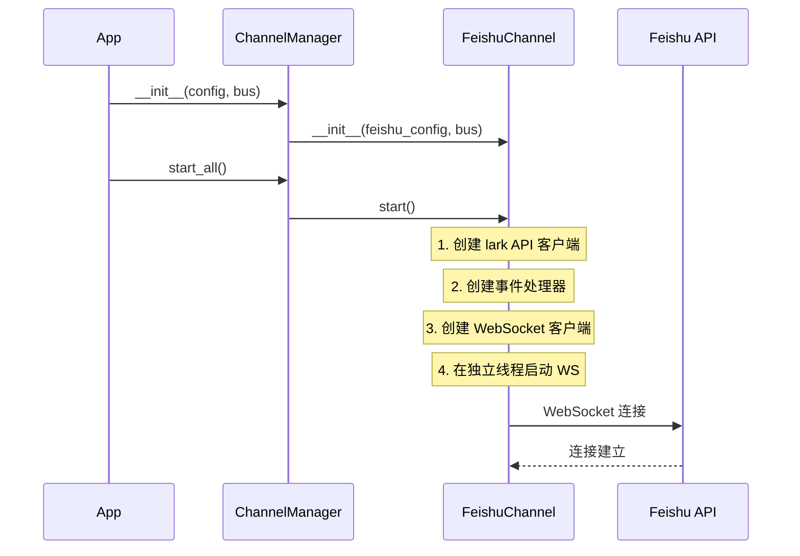
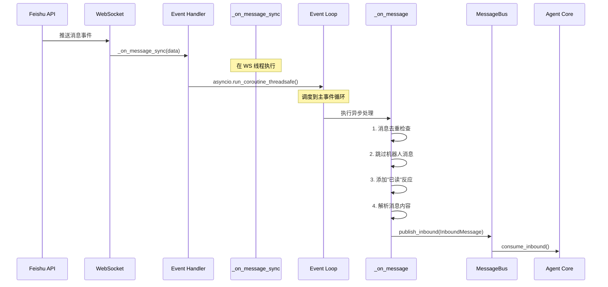
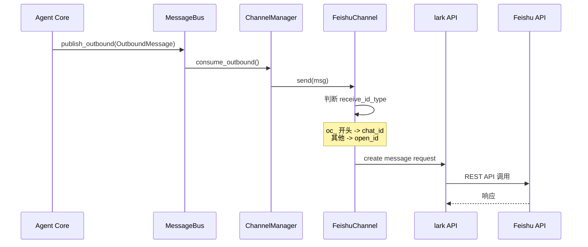

# 飞书 Channel 实现方案文档

## 文档目的

本文档详细分析了 nanobot 项目中飞书 (Feishu/Lark) channel 的完整实现方案，供您在迁移到其他项目时参考。

---

## 1. 整体架构

### 1.1 架构模式

飞书 channel 采用**插件化架构**和**消息总线模式**：

```
┌─────────────────┐      ┌──────────────────┐      ┌─────────────────┐
│  Feishu Channel │ ───> │   MessageBus     │ <─── │    Agent Core   │
│  (WebSocket)    │      │  (async Queue)   │      │  (LLM 处理)      │
└─────────────────┘      └──────────────────┘      └─────────────────┘
        ↑                         │
        │                         ↓
┌─────────────────┐      ┌──────────────────┐
│  Feishu API     │      │ Outbound Queue   │
│  (lark-oapi)    │      │ (消息分发)        │
└─────────────────┘      └──────────────────┘
```

**核心特点**：
- **WebSocket 长连接**：无需公网 IP 或 webhook
- **异步解耦**：通过 asyncio Queue 实现 channel 和 agent 的解耦
- **插件化设计**：通过继承 BaseChannel 实现标准化接口

### 1.2 组件关系

```
ChannelManager (管理器)
    ├── FeishuChannel (飞书实现)
    ├── TelegramChannel
    ├── DiscordChannel
    └── WhatsAppChannel

MessageBus (消息总线)
    ├── inbound: Queue[InboundMessage]  (接收消息)
    └── outbound: Queue[OutboundMessage] (发送消息)

BaseChannel (抽象基类)
    ├── start()    # 启动 channel
    ├── stop()     # 停止 channel
    └── send()     # 发送消息
```

---

## 2. 核心文件及职责

### 2.1 文件结构

```
nanobot/
├── channels/
│   ├── __init__.py           # 模块导出
│   ├── base.py               # BaseChannel 抽象基类 (128行)
│   ├── manager.py            # ChannelManager 管理器 (162行)
│   └── feishu.py             # 飞书 channel 实现 (264行) ⭐
├── bus/
│   ├── events.py             # InboundMessage/OutboundMessage 事件定义 (38行)
│   └── queue.py              # MessageBus 消息总线实现 (82行)
└── config/
    └── schema.py             # FeishuConfig 配置模型 (31行)
```

### 2.2 关键文件说明

#### [base.py](nanobot/channels/base.py) - BaseChannel 抽象基类

**核心职责**：
- 定义所有 channel 必须实现的接口
- 提供消息权限检查 (`is_allowed`)
- 统一消息处理流程 (`_handle_message`)

**关键方法**：
```python
class BaseChannel(ABC):
    name: str = "base"  # channel 标识

    # 必须实现的抽象方法
    @abstractmethod
    async def start(self) -> None: ...

    @abstractmethod
    async def stop(self) -> None: ...

    @abstractmethod
    async def send(self, msg: OutboundMessage) -> None: ...

    # 通用权限检查
    def is_allowed(self, sender_id: str) -> bool:
        allow_list = getattr(self.config, "allow_from", [])
        return not allow_list or sender_id in allow_list

    # 统一消息处理
    async def _handle_message(self, sender_id, chat_id, content, ...):
        if not self.is_allowed(sender_id):
            return  # 拒绝未授权用户
        msg = InboundMessage(channel=self.name, ...)
        await self.bus.publish_inbound(msg)
```

**文件位置**：`nanobot/channels/base.py`

---

#### [feishu.py](nanobot/channels/feishu.py) - 飞书 Channel 实现

**核心职责**：
- 使用 lark-oapi SDK 建立 WebSocket 长连接
- 接收飞书消息并转发到 MessageBus
- 从 MessageBus 接收响应并发送到飞书
- 消息去重和权限控制

**类结构**：
```python
class FeishuChannel(BaseChannel):
    name = "feishu"

    def __init__(self, config: FeishuConfig, bus: MessageBus):
        self._client: Any = None              # API 客户端 (发送消息)
        self._ws_client: Any = None           # WebSocket 客户端 (接收消息)
        self._ws_thread: threading.Thread     # WebSocket 运行线程
        self._processed_message_ids: OrderedDict  # 消息去重缓存
        self._loop: asyncio.AbstractEventLoop # 主事件循环引用
```

**文件位置**：`nanobot/channels/feishu.py:41-63`

---

#### [manager.py](nanobot/channels/manager.py) - Channel 管理器

**核心职责**：
- 根据配置初始化启用的 channels
- 启动/停止所有 channels
- 分发 outbound 消息到对应 channel

**初始化流程**：
```python
class ChannelManager:
    def _init_channels(self):
        # 遍历配置，初始化启用的 channels
        if config.channels.feishu.enabled:
            from nanobot.channels.feishu import FeishuChannel
            self.channels["feishu"] = FeishuChannel(
                config.channels.feishu, bus
            )
```

**文件位置**：`nanobot/channels/manager.py:32-79`

---

#### [events.py](nanobot/bus/events.py) - 事件定义

**数据结构**：
```python
@dataclass
class InboundMessage:
    channel: str          # "feishu"
    sender_id: str        # 用户 open_id
    chat_id: str          # 聊天 ID
    content: str          # 消息文本
    media: list[str]      # 附件列表
    metadata: dict        # 额外元数据

    @property
    def session_key(self) -> str:
        return f"{self.channel}:{self.chat_id}"

@dataclass
class OutboundMessage:
    channel: str
    chat_id: str
    content: str
    reply_to: str | None
    media: list[str]
    metadata: dict
```

**文件位置**：`nanobot/bus/events.py`

---

#### [queue.py](nanobot/bus/queue.py) - MessageBus 消息总线

**核心职责**：
- 使用 asyncio.Queue 实现异步消息队列
- 提供 inbound/outbound 消息的发布/消费接口
- 支持按 channel 订阅 outbound 消息

**关键接口**：
```python
class MessageBus:
    def __init__(self):
        self.inbound: asyncio.Queue[InboundMessage]
        self.outbound: asyncio.Queue[OutboundMessage]

    # 发布/消费 inbound 消息
    async def publish_inbound(self, msg: InboundMessage)
    async def consume_inbound(self) -> InboundMessage

    # 发布/消费 outbound 消息
    async def publish_outbound(self, msg: OutboundMessage)
    async def consume_outbound(self) -> OutboundMessage

    # 订阅模式
    def subscribe_outbound(self, channel, callback)
    async def dispatch_outbound(self)  # 分发消息到订阅者
```

**文件位置**：`nanobot/bus/queue.py`

---

#### [schema.py](nanobot/config/schema.py) - 配置模型

**飞书配置结构**：
```python
class FeishuConfig(BaseModel):
    enabled: bool = False
    app_id: str = ""           # 飞书开放平台 App ID
    app_secret: str = ""       # 飞书开放平台 App Secret
    encrypt_key: str = ""      # 事件订阅加密 Key (可选)
    verification_token: str = ""  # 验证 Token (可选)
    allow_from: list[str] = []  # 允许的用户 open_id 列表
```

**配置示例** (YAML):
```yaml
channels:
  feishu:
    enabled: true
    app_id: "cli_xxxxxxxxx"
    app_secret: "xxxxxxxxxxxxxxxx"
    allow_from: []
```

**文件位置**：`nanobot/config/schema.py:23-30`

---

## 3. 消息流程详解

### 3.1 启动流程



**代码实现**：[feishu.py:64-110](nanobot/channels/feishu.py)

```python
async def start(self) -> None:
    # 1. 检查依赖和配置
    if not FEISHU_AVAILABLE:
        logger.error("Feishu SDK not installed. Run: pip install lark-oapi")
        return

    # 2. 创建 API 客户端 (用于发送消息)
    self._client = lark.Client.builder() \
        .app_id(self.config.app_id) \
        .app_secret(self.config.app_secret) \
        .build()

    # 3. 创建事件处理器 (接收消息)
    event_handler = lark.EventDispatcherHandler.builder(
        self.config.encrypt_key or "",
        self.config.verification_token or "",
    ).register_p2_im_message_receive_v1(
        self._on_message_sync  # 注册回调
    ).build()

    # 4. 创建 WebSocket 客户端
    self._ws_client = lark.ws.Client(
        self.config.app_id,
        self.config.app_secret,
        event_handler=event_handler,
    )

    # 5. 在独立线程启动 WebSocket (因为 ws.start() 是阻塞的)
    self._ws_thread = threading.Thread(
        target=lambda: self._ws_client.start(),
        daemon=True
    )
    self._ws_thread.start()

    # 6. 保存主事件循环引用，用于跨线程调度
    self._loop = asyncio.get_running_loop()

    # 7. 保持运行
    while self._running:
        await asyncio.sleep(1)
```

### 3.2 接收消息流程



**代码实现**：[feishu.py:207-263](nanobot/channels/feishu.py)

```python
async def _on_message(self, data: "P2ImMessageReceiveV1") -> None:
    event = data.event
    message = event.message
    sender = event.sender

    # 1. 去重检查 (OrderedDict + LRU)
    message_id = message.message_id
    if message_id in self._processed_message_ids:
        return  # 已处理过
    self._processed_message_ids[message_id] = None

    # 缓存管理：超过 1000 条时保留最近 500 条
    while len(self._processed_message_ids) > 1000:
        self._processed_message_ids.popitem(last=False)

    # 2. 跳过机器人自己的消息
    if sender.sender_type == "bot":
        return

    # 3. 添加"已读"反应 (👍)
    await self._add_reaction(message_id, "THUMBSUP")

    # 4. 解析消息内容
    msg_type = message.message_type
    if msg_type == "text":
        content = json.loads(message.content).get("text", "")
    else:
        content = MSG_TYPE_MAP.get(msg_type, f"[{msg_type}]")

    # 5. 转发到消息总线
    chat_id = message.chat_id
    sender_id = sender.sender_id.open_id
    reply_to = chat_id if message.chat_type == "group" else sender_id

    await self._handle_message(
        sender_id=sender_id,
        chat_id=reply_to,
        content=content,
        metadata={
            "message_id": message_id,
            "chat_type": message.chat_type,  # "p2p" or "group"
            "msg_type": msg_type,
        }
    )
```

**关键点**：
- **跨线程调度**：WebSocket 回调在独立线程，需要用 `asyncio.run_coroutine_threadsafe()` 调度到主事件循环
- **消息去重**：使用 OrderedDict 实现 LRU 缓存，防止重复处理
- **反应反馈**：自动添加 👍 反应，让用户知道 bot 已收到消息

### 3.3 发送消息流程



**代码实现**：[feishu.py:159-197](nanobot/channels/feishu.py)

```python
async def send(self, msg: OutboundMessage) -> None:
    # 1. 判断接收者类型
    if msg.chat_id.startswith("oc_"):
        receive_id_type = "chat_id"  # 群聊
    else:
        receive_id_type = "open_id"  # 私聊

    # 2. 构建消息内容
    content = json.dumps({"text": msg.content})

    # 3. 创建请求
    request = CreateMessageRequest.builder() \
        .receive_id_type(receive_id_type) \
        .request_body(
            CreateMessageRequestBody.builder()
            .receive_id(msg.chat_id)
            .msg_type("text")
            .content(content)
            .build()
        ).build()

    # 4. 发送 API 请求
    response = self._client.im.v1.message.create(request)

    # 5. 错误处理
    if not response.success():
        logger.error(
            f"Failed to send: code={response.code}, "
            f"msg={response.msg}, log_id={response.get_log_id()}"
        )
```

---

## 4. 关键技术点

### 4.1 WebSocket 长连接 vs Webhook

| 方案 | 优点 | 缺点 |
|------|------|------|
| **WebSocket** | - 无需公网 IP<br/>- 无需配置 webhook<br/>- 适合本地开发 | - 需要维护长连接<br/>- 断线需重连 |
| **Webhook** | - 被动接收<br/>- 无需维护连接 | - 需要公网 IP<br/>- 需要 HTTPS<br/>- 配置复杂 |

**飞书选择 WebSocket 的原因**：
- 用户可在本地运行 bot，无需服务器
- lark-oapi SDK 自动处理重连逻辑

### 4.2 消息去重机制

```python
# 使用 OrderedDict 实现 LRU 缓存
self._processed_message_ids: OrderedDict[str, None] = OrderedDict()

# 检查
if message_id in self._processed_message_ids:
    return
self._processed_message_ids[message_id] = None

# 自动清理：超过 1000 条时保留最近 500 条
while len(self._processed_message_ids) > 1000:
    self._processed_message_ids.popitem(last=False)
```

**文件位置**：[feishu.py:214-222](nanobot/channels/feishu.py)

### 4.3 跨线程异步调度

```python
# WebSocket 回调 (在独立线程)
def _on_message_sync(self, data: "P2ImMessageReceiveV1") -> None:
    # 调度到主事件循环
    if self._loop and self._loop.is_running():
        asyncio.run_coroutine_threadsafe(
            self._on_message(data),
            self._loop
        )
```

**文件位置**：[feishu.py:199-205](nanobot/channels/feishu.py)

### 4.4 权限控制

```python
# 在 BaseChannel 实现
def is_allowed(self, sender_id: str) -> bool:
    allow_list = getattr(self.config, "allow_from", [])
    if not allow_list:
        return True  # 空列表 = 允许所有人
    return sender_id in allow_list
```

**文件位置**：[base.py:61-84](nanobot/channels/base.py)

---

## 5. 依赖和配置

### 5.1 依赖包

**必须**：
```bash
pip install lark-oapi
```

**可选**（用于日志）：
```bash
pip install loguru
```

### 5.2 飞书开放平台配置

1. **创建应用**：https://open.feishu.cn/app
2. **获取凭证**：
   - App ID
   - App Secret
3. **启用能力**：
   - 机器人能力
   - 事件订阅 (im.message.receive_v1)
4. **权限配置**：
   - `im:message` (接收和发送消息)
   - `im:message:send_as_bot` (以机器人身份发送)

### 5.3 运行时配置

```yaml
channels:
  feishu:
    enabled: true
    app_id: "cli_xxxxxxxxx"
    app_secret: "xxxxxxxxxxxxxxxx"
    encrypt_key: ""  # 可选
    verification_token: ""  # 可选
    allow_from: []  # 空列表允许所有人，或指定 open_id
```

---

## 6. 迁移指南

### 6.1 最小迁移清单

如果要将飞书 channel 迁移到其他项目，需要复制以下文件：

```
必需文件：
├── channels/base.py          # 基类
├── channels/feishu.py        # 飞书实现
├── bus/events.py             # 事件定义
├── bus/queue.py              # 消息总线
└── config/schema.py          # 配置模型 (FeishuConfig 部分)

可选文件：
└── channels/manager.py       # 如果需要多 channel 管理
```

### 6.2 适配步骤

#### 步骤 1：安装依赖

```bash
pip install lark-oapi pydantic loguru
```

#### 步骤 2：复制文件

将上述文件复制到目标项目的对应目录。

#### 步骤 3：适配配置

修改配置加载逻辑，确保能读取 `FeishuConfig`：

```python
from pydantic import BaseModel

class FeishuConfig(BaseModel):
    enabled: bool = False
    app_id: str = ""
    app_secret: str = ""
    encrypt_key: str = ""
    verification_token: str = ""
    allow_from: list[str] = []
```

#### 步骤 4：集成到项目

```python
import asyncio
from nanobot.channels.feishu import FeishuChannel
from nanobot.bus.queue import MessageBus

async def main():
    # 创建消息总线
    bus = MessageBus()

    # 创建配置
    config = FeishuConfig(
        enabled=True,
        app_id="cli_xxx",
        app_secret="xxx",
    )

    # 创建 channel
    channel = FeishuChannel(config, bus)

    # 启动
    await channel.start()

if __name__ == "__main__":
    asyncio.run(main())
```

### 6.3 自定义适配点

#### 如果不使用 MessageBus

修改 `_handle_message` 方法，直接处理消息：

```python
# 原代码
await self.bus.publish_inbound(msg)

# 改为直接调用你的处理逻辑
await your_message_handler(msg)
```

#### 如果需要不同的消息格式

修改 `InboundMessage` 和 `OutboundMessage`：

```python
@dataclass
class InboundMessage:
    channel: str
    sender_id: str
    chat_id: str
    content: str
    # 添加你需要的字段...
```

#### 如果不需要 WebSocket

可以改为使用 webhook 模式（需要公网 IP）：

```python
# 使用 Flask/FastAPI 接收 webhook
@app.post("/feishu/webhook")
async def webhook(request: Request):
    # 验证签名
    # 处理事件
    pass
```

### 6.4 测试建议

1. **单元测试**：测试消息解析逻辑
2. **集成测试**：测试与飞书 API 的交互
3. **端到端测试**：发送真实消息并验证响应

---

## 7. 常见问题

### Q1: WebSocket 连接失败？

**检查**：
- app_id 和 app_secret 是否正确
- 网络是否正常
- 飞书开放平台是否启用了机器人能力

### Q2: 收不到消息？

**检查**：
- 事件订阅是否配置了 `im.message.receive_v1`
- 权限是否包含 `im:message`
- `allow_from` 是否为空（空列表允许所有人）

### Q3: 消息发送失败？

**检查**：
- chat_id 格式是否正确（open_id 或 chat_id）
- receive_id_type 是否正确设置
- bot 权限是否包含 `im:message:send_as_bot`

---

## 8. 代码片段速查

### 初始化 FeishuChannel

```python
from nanobot.channels.feishu import FeishuChannel
from nanobot.bus.queue import MessageBus
from nanobot.config.schema import FeishuConfig

bus = MessageBus()
config = FeishuConfig(
    enabled=True,
    app_id="cli_xxx",
    app_secret="xxx",
)
channel = FeishuChannel(config, bus)
await channel.start()
```

### 发送消息

```python
from nanobot.bus.events import OutboundMessage

msg = OutboundMessage(
    channel="feishu",
    chat_id="ou_xxx",  # open_id 或 chat_id
    content="Hello, World!",
)
await channel.send(msg)
```

### 检查权限

```python
if channel.is_allowed(sender_id):
    # 允许访问
    pass
else:
    # 拒绝访问
    pass
```

---

## 9. 架构优势总结

1. **解耦设计**：channel 和 agent 通过消息总线解耦，易于扩展
2. **插件化**：通过继承 BaseChannel，新增 channel 只需实现 3 个方法
3. **异步优先**：全程使用 asyncio，性能优异
4. **本地友好**：WebSocket 长连接无需公网 IP，适合本地开发
5. **权限控制**：内置 allow_list 机制，安全可控

---

## 10. 参考资料

- **飞书开放平台**：https://open.feishu.cn/
- **lark-oapi SDK**：https://github.com/larksuite/lark-oapi-python
- **WebSocket 文档**：https://open.feishu.cn/document/server-docs/event-subscription-guide/event-subscription-introduction

---

**文档生成时间**：2026-02-08
**项目路径**：`e:\StudySpace\AI\AI Agent\nanobot`
**核心文件**：[nanobot/channels/feishu.py](nanobot/channels/feishu.py)
