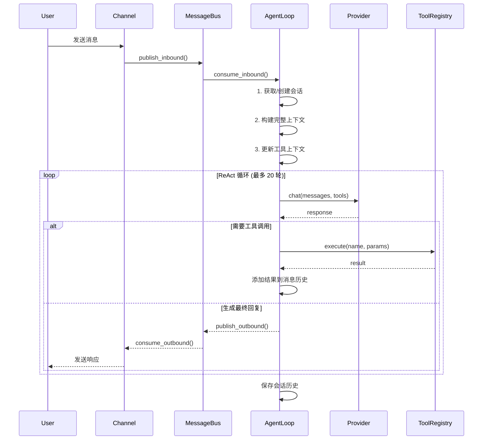

# nanobot 项目架构分析

> 超轻量级个人 AI 助手框架 | 约 8,012 行核心代码 | Python 3.11+

## 📋 目录

- [项目概览](#项目概览)
- [整体架构](#整体架构)
- [核心模块详解](#核心模块详解)
- [设计模式](#设计模式)
- [模块依赖关系](#模块依赖关系)
- [核心工作流程](#核心工作流程)
- [技术栈](#技术栈)
- [项目特色](#项目特色)

---

## 🎯 项目概览

**nanobot** 是一个设计精良的轻量级个人 AI 助手框架，采用 **ReAct（推理-行动）模式**实现智能决策循环。项目特点是代码简洁、模块化设计优秀、支持多 LLM 提供商和多聊天平台集成。

### 核心特性

- ✅ **轻量级**：约 8000 行代码实现完整 Agent 功能
- ✅ **异步架构**：全面使用 asyncio，高并发消息处理
- ✅ **多平台支持**：Telegram、Discord、飞书、WhatsApp
- ✅ **多 LLM 提供商**：OpenRouter、Anthropic、OpenAI、DeepSeek、本地 vLLM 等
- ✅ **插件化设计**：工具、技能、渠道均支持动态扩展
- ✅ **浏览器自动化**：基于 Playwright 的网页自动化和登录
- ✅ **生产就绪**：完善的配置、日志、安全机制

---

## 🏗️ 整体架构

### 分层架构图

```
┌─────────────────────────────────────────────────────────┐
│                       CLI / 应用入口                      │
│              (nanobot/cli/commands.py)                   │
└────────────────────┬────────────────────────────────────┘
                     │
                     ↓
┌─────────────────────────────────────────────────────────┐
│                    配置管理 (Config)                      │
│              (nanobot/config/loader.py)                  │
└────────────────────┬────────────────────────────────────┘
                     │
       ┌─────────────┼─────────────┬──────────────┐
       ↓             ↓             ↓              ↓
┌──────────┐  ┌──────────┐  ┌─────────┐  ┌──────────┐
│ Gateway  │  │  Agent   │  │ Channel │  │  Cron    │
│ Command  │  │  Loop    │  │ Manager │  │ Service  │
└──────────┘  └────┬─────┘  └────┬────┘  └──────────┘
                   │             │
                   ↓             ↓
         ┌──────────────────────────┐
         │      MessageBus          │
         │    (消息总线/事件驱动)     │
         └───────────┬──────────────┘
                     │
        ┌────────────┼────────────┐
        ↓            ↓            ↓
   ┌─────────┐  ┌─────────┐  ┌────────────┐
   │Provider │  │Session  │  │  Subagent  │
   │(LiteLLM)│  │Manager  │  │  Manager   │
   └─────────┘  └─────────┘  └────────────┘
        │            │              │
        └────────────┼──────────────┘
                     ↓
          ┌────────────────────┐
          │   Tool Registry    │
          │   (工具注册表)      │
          └────────────────────┘
                     │
        ┌────────────┼────────────┐
        ↓            ↓            ↓
   ┌─────────┐  ┌──────────┐  ┌──────┐
   │ Tools   │  │ Context  │  │Skills │
   │(插件化) │  │ Builder  │  │Loader │
   └─────────┘  └──────────┘  └──────┘
```

### 消息流架构

```
用户消息
  ↓
聊天平台适配器 (Telegram/Discord/飞书)
  ↓
MessageBus.inbound (入站队列)
  ↓
AgentLoop.consume_inbound()
  ├─ 获取/创建会话
  ├─ 构建完整上下文 (身份+记忆+技能)
  ├─ LLM 调用循环 (ReAct 模式)
  │  ├─ LLM 思考
  │  ├─ 决策工具调用
  │  ├─ 执行工具
  │  └─ 反馈结果 → 重新思考 (最多 20 轮)
  └─ 保存会话历史
  ↓
MessageBus.outbound (出站队列)
  ↓
ChannelManager.dispatch_outbound()
  ↓
聊天平台发送响应
  ↓
用户接收
```

---

## 🔧 核心模块详解

### 1. Agent 循环 ⭐核心

**文件**: [`nanobot/agent/loop.py`](nanobot/agent/loop.py) (426 行)

**职责**: 实现 ReAct 模式的智能体决策循环

**核心机制**:
```python
while iteration < max_iterations:
    # 1. 调用 LLM
    response = await provider.chat(messages, tools)

    # 2. 判断是否需要工具调用
    if response.has_tool_calls:
        # 3. 执行工具调用
        for tool_call in response.tool_calls:
            result = await tools.execute(tool_call.name, tool_call.arguments)
            messages = add_tool_result(messages, tool_call.id, result)

        # 4. 继续下一轮迭代
        iteration += 1
    else:
        # 5. 生成最终回复
        final_content = response.content
        break
```

**关键功能**:
- 从消息总线接收消息并处理
- 构建上下文（历史、记忆、技能）
- 管理子 Agent 通信
- 保存会话历史
- 迭代次数限制（默认 20 次）

---

### 2. 消息总线 ⭐核心

**文件**: [`nanobot/bus/queue.py`](nanobot/bus/queue.py) (82 行)

**职责**: 解耦聊天平台和 Agent 的异步消息传递

**架构设计**:
```python
class MessageBus:
    inbound: asyncio.Queue   # 入站消息队列
    outbound: asyncio.Queue  # 出站消息队列

    async def publish_inbound(self, msg: InboundMessage)
    async def publish_outbound(self, msg: OutboundMessage)
    async def consume_inbound(self) -> InboundMessage
    async def consume_outbound(self) -> OutboundMessage
```

**设计模式**: 生产者-消费者模式

**特点**:
- 异步非阻塞
- 解耦渠道和 Agent
- 支持并发处理

---

### 3. 工具系统 ⭐扩展点

**目录**: [`nanobot/agent/tools/`](nanobot/agent/tools/)

**职责**: 为 Agent 提供可执行的能力

**工具接口**:
```python
class Tool(ABC):
    @property
    def name(self) -> str: ...

    @property
    def description(self) -> str: ...

    @property
    def parameters(self) -> dict: ...  # JSON Schema

    async def execute(self, **kwargs) -> str: ...
```

**内置工具清单**:

| 工具 | 文件 | 功能 |
|------|------|------|
| **文件系统** | [`filesystem.py`](nanobot/agent/tools/filesystem.py) | read_file, write_file, edit_file, list_dir |
| **Shell** | [`shell.py`](nanobot/agent/tools/shell.py) | 执行命令行工具 |
| **Web** | [`web.py`](nanobot/agent/tools/web.py) | 网页搜索、抓取 |
| **浏览器** | [`browser.py`](nanobot/agent/tools/browser.py) | 浏览器自动化（导航、点击、输入、登录） |
| **消息** | [`message.py`](nanobot/agent/tools/message.py) | 主动发送消息到聊天平台 |
| **子 Agent** | [`spawn.py`](nanobot/agent/tools/spawn.py) | 创建后台子 Agent |
| **Cron** | [`cron.py`](nanobot/agent/tools/cron.py) | 管理定时任务 |

**工具注册表**: [`registry.py`](nanobot/agent/tools/registry.py)
- 动态注册和执行
- 参数验证（JSON Schema）
- 异常处理

---

### 4. 渠道管理器 ⭐适配层

**目录**: [`nanobot/channels/`](nanobot/channels/)

**职责**: 协调多个聊天平台适配器

**支持平台**:

| 平台 | 文件 | 协议 |
|------|------|------|
| **Telegram** | [`telegram.py`](nanobot/channels/telegram.py) | Bot API |
| **Discord** | [`discord.py`](nanobot/channels/discord.py) | Gateway WebSocket |
| **飞书** | [`feishu.py`](nanobot/channels/feishu.py) | 长连接 WebSocket |
| **WhatsApp** | [`whatsapp.py`](nanobot/channels/whatsapp.py) | Node.js 桥接 |

**渠道接口**:
```python
class BaseChannel(ABC):
    async def start(self) -> None: ...           # 启动连接
    async def stop(self) -> None: ...            # 停止连接
    async def send(self, msg: OutboundMessage) -> None: ...  # 发送消息
    def is_allowed(self, sender_id: str) -> bool: ...       # 权限控制
```

**渠道管理器**: [`manager.py`](nanobot/channels/manager.py)
- 根据配置创建渠道
- 统一消息分发
- 并发处理多个平台

---

### 5. LLM 提供商 ⭐抽象层

**文件**: [`nanobot/providers/litellm_provider.py`](nanobot/providers/litellm_provider.py) (203 行)

**职责**: 统一接口对接多个 LLM 提供商

**支持的提供商** (通过 LiteLLM):

| 提供商 | 模型前缀 | 特点 |
|--------|----------|------|
| **OpenRouter** | `openrouter/` | 聚合多家，推荐使用 |
| **Anthropic** | `anthropic/` | Claude 系列 |
| **OpenAI** | `openai/` | GPT 系列 |
| **DeepSeek** | `deepseek/` | 深度求索 |
| **Gemini** | `gemini/` | Google 模型 |
| **Moonshot** | `moonshot/` | 月之暗面 Kimi |
| **DashScope** | `dashscope/` | 通义千问 |
| **vLLM** | `local/` | 本地模型 |

**智能路由**:
- 根据模型名称自动匹配提供商
- 支持 API Key、API Base 自定义
- 自动添加模型前缀

---

### 6. 浏览器自动化 🔥新增

**目录**: [`nanobot/browser/`](nanobot/browser/)

**职责**: 网页自动化和身份认证

#### 6.1 核心组件

| 组件 | 文件 | 职责 |
|------|------|------|
| **会话管理** | [`session.py`](nanobot/browser/session.py) | Playwright 浏览器生命周期管理 |
| **页面交互** | [`actions.py`](nanobot/browser/actions.py) | 导航、点击、输入、等待元素 |
| **页面快照** | [`snapshot.py`](nanobot/browser/snapshot.py) | 可访问性树提取（MCP 兼容） |
| **凭证管理** | [`credentials.py`](nanobot/browser/credentials.py) | 系统密钥环存储 |
| **权限控制** | [`permissions.py`](nanobot/browser/permissions.py) | 域名白名单 |

#### 6.2 适配器模式 (`adapters/`)

**基类**: [`base.py`](nanobot/browser/adapters/base.py)
```python
class WebsiteAdapter(ABC):
    NAME: str                      # 唯一标识符
    DOMAINS: list[str]             # 处理的域模式（支持通配符）
    DISPLAY_NAME: str              # 人类可读名称

    @abstractmethod
    async def login(session, username, password) -> LoginResult

    async def verify_login(session) -> bool: ...

    @classmethod
    def get_priority() -> int: ...  # 优先级（越高越优先）
```

**专用适配器**:

| 适配器 | 文件 | 适用场景 |
|--------|------|----------|
| **QQ Mail** | [`qq_mail.py`](nanobot/browser/adapters/qq_mail.py) | QQ 邮箱专用 |
| **通用登录** | [`generic.py`](nanobot/browser/adapters/generic.py) | 60-70% 标准登录表单 |
| **手动登录** | [`manual.py`](nanobot/browser/adapters/manual.py) | 验证码、复杂流程 |

**注册表**: [`registry.py`](nanobot/browser/adapters/registry.py)
- 管理适配器注册和查找
- 支持通配符域名匹配
- 按优先级选择适配器

#### 6.3 登录编排流程

**三层策略** (`adapters/__init__.py`):

```
策略: auto（默认）
┌─────────────────────────────────────────┐
│ Layer 1: 专用适配器                       │
│ - 查找域名匹配的适配器                     │
│ - 执行登录                                │
│ - 成功 → 返回 / 失败 → 继续               │
├─────────────────────────────────────────┤
│ Layer 2: 通用适配器                       │
│ - 使用启发式规则尝试                       │
│ - 成功 → 返回 / 失败 → 继续               │
├─────────────────────────────────────────┤
│ Layer 3: 手动登录                         │
│ - 打开浏览器供用户操作                     │
│ - 轮询等待登录完成（最多 5 分钟）          │
└─────────────────────────────────────────┘
```

#### 6.4 关键特性

- **安全性**: 域名白名单、系统密钥环存储、文件权限保护
- **鲁棒性**: 多级登录策略、异常处理、超时控制
- **可扩展性**: 轻松添加新适配器、模块化设计
- **LLM 友好**: 可访问性树提取、结构化页面表示

---

### 7. 上下文构建器 🧠智能

**文件**: [`nanobot/agent/context.py`](nanobot/agent/context.py) (231 行)

**职责**: 组装发送给 LLM 的完整上下文

**上下文组装顺序**:

```
1. 核心身份
   ├─ 当前时间
   ├─ 工作区路径
   └─ Agent 能力描述

2. 引导文件 (从工作区加载)
   ├─ AGENTS.md  (Agent 角色定义)
   ├─ SOUL.md    (个性特征)
   ├─ USER.md    (用户偏好)
   └─ TOOLS.md   (工具说明)

3. 记忆上下文
   ├─ 长期记忆 (memory/MEMORY.md)
   └─ 今日笔记 (memory/YYYY-MM-DD.md)

4. 技能
   ├─ always=true 技能 (完整内容)
   └─ 其他技能 (XML 格式摘要，按需加载)
```

**渐进式技能加载**:
- `always=true` 技能：总是加载完整内容
- 其他技能：仅显示 XML 摘要，LLM 通过 `read_file` 按需加载
- 避免 Token 浪费

**特性**:
- 支持图片等多媒体内容（base64 编码）
- 动态会话信息注入
- 智能技能管理

---

### 8. 会话管理 💾持久化

**文件**: [`nanobot/session/manager.py`](nanobot/session/manager.py) (202 行)

**职责**: 持久化对话历史

**存储格式**:
- **位置**: `~/.nanobot/sessions/{channel}_{chat_id}.jsonl`
- **格式**: JSONL（每行一个 JSON 对象）
- **结构**: 元数据行 + 消息行

**特性**:
- **内存缓存**: 快速访问最近会话
- **历史截断**: 默认最多 50 条消息
- **按更新时间排序**: 优先加载活跃会话

**数据结构**:
```json
{"type": "metadata", "created_at": "2024-01-01T00:00:00Z"}
{"type": "message", "role": "user", "content": "..."}
{"type": "message", "role": "assistant", "content": "..."}
```

---

### 9. 技能系统 🔧插件化

**目录**: [`nanobot/skills/`](nanobot/skills/)

**职责**: 动态加载和管理 Agent 技能

**技能来源优先级**:
```
工作区技能 (workspace/skills/{name}/SKILL.md)
    ↓ 未找到
内置技能 (nanobot/skills/{name}/SKILL.md)
```

**技能元数据** (YAML frontmatter):
```yaml
---
description: "技能描述"
requires:
  bins: ["git", "node"]  # 需要的 CLI 工具
  env: ["API_KEY"]       # 需要的环境变量
---

# 技能内容
...
```

**加载策略**:
- **总是加载**: `always: true` → 完整内容到上下文
- **按需加载**: 仅显示 XML 摘要 → LLM 调用 `read_file`

**技能加载器**: [`agent/skills.py`](nanobot/agent/skills.py)

---

### 10. 定时任务 ⏰调度

**目录**: [`nanobot/cron/`](nanobot/cron/)

**职责**: 定时任务调度和执行

**核心文件**:

| 文件 | 职责 |
|------|------|
| [`service.py`](nanobot/cron/service.py) (346 行) | Cron 服务，支持 cron 表达式和间隔调度 |
| [`types.py`](nanobot/cron/types.py) | 任务数据模型 |

**功能**:
- **Cron 表达式**: 标准的 5 字段表达式（分 时 日 月 周）
- **间隔调度**: `every: 60` (每 60 秒)
- **持久化**: JSON 文件存储 (`~/.nanobot/cron.json`)
- **结果投递**: 任务结果发送到指定渠道

**CLI 命令**:
```bash
nanobot cron add "0 9 * * *" "Good morning" --channel telegram
nanobot cron list
nanobot cron remove <id>
```

---

### 11. 子 Agent 管理 🔄并行

**文件**: [`nanobot/agent/subagent.py`](nanobot/agent/subagent.py) (244 行)

**职责**: 创建和管理后台任务

**工作流程**:
```
1. 主 Agent 调用 spawn 工具
   ↓
2. 创建子 Agent (独立 asyncio 任务)
   ├─ 独立上下文（无历史记录）
   ├─ 限制工具集（无 message、spawn 工具）
   └─ 专注的系统提示（单任务导向）
   ↓
3. 子 Agent 执行任务
   ↓
4. 完成后通过系统频道向主 Agent 公布结果
   ↓
5. 主 Agent 自然地总结结果给用户
```

**特点**:
- 并行处理后台任务
- 不阻塞主 Agent
- 结果自动汇报

---

### 12. 配置系统 ⚙️设置

**目录**: [`nanobot/config/`](nanobot/config/)

**核心文件**:

| 文件 | 职责 |
|------|------|
| [`schema.py`](nanobot/config/schema.py) (197 行) | Pydantic 配置模型定义 |
| [`loader.py`](nanobot/config/loader.py) (107 行) | 加载/保存配置，camelCase ↔ snake_case 转换 |

**配置结构** (`~/.nanobot/config.json`):
```json
{
  "providers": {
    "apiKey": "...",
    "apiBase": "...",
    "model": "anthropic/claude-opus-4-5"
  },
  "agents": {
    "defaults": {
      "model": "anthropic/claude-opus-4-5",
      "workspace": "~/.nanobot/workspace"
    }
  },
  "channels": {
    "telegram": {
      "botToken": "...",
      "allowFrom": ["*"]
    }
  },
  "tools": {
    "web": {
      "search": {
        "apiKey": "..."
      }
    },
    "restrictToWorkspace": false
  },
  "browser": {
    "enabled": false,
    "headless": true,
    "timeout": 30000,
    "profileDir": "~/.nanobot/browser-profile",
    "allowedDomains": ["*.example.com"],
    "autoLoginDomains": ["mail.qq.com"]
  }
}
```

---

## 🎨 设计模式

### 架构模式

| 模式 | 应用场景 | 说明 |
|------|----------|------|
| **分层架构** | CLI → Service → Agent → Tools | 职责分离，易于维护 |
| **事件驱动** | MessageBus 发布-订阅 | 异步解耦，高并发 |
| **插件化** | 工具、技能、渠道 | 动态扩展，开放封闭原则 |

### 设计模式

| 模式 | 应用场景 |
|------|----------|
| **策略模式** | Tool 接口、Channel 接口、定位策略（aria/css/id） |
| **适配器模式** | WebsiteAdapter（网站登录）、LLM 提供商统一接口 |
| **观察者模式** | MessageBus 的发布-订阅机制 |
| **工厂模式** | ChannelManager 根据配置创建渠道、AdapterRegistry 创建适配器 |
| **责任链模式** | 三层登录策略（专用→通用→手动） |
| **建造者模式** | ContextBuilder 组装 LLM 上下文 |
| **代理模式** | LiteLLMProvider 统一多家 LLM 接口 |
| **单例模式** | Session、Config 的共享实例 |

### 设计原则

- ✅ **关注点分离**: 消息传递、业务逻辑、外部适配器分离
- ✅ **开放封闭**: 通过注册表动态扩展工具/渠道
- ✅ **依赖注入**: 通过构造函数注入依赖（bus、provider）
- ✅ **异步优先**: 全面使用 asyncio 实现高并发
- ✅ **接口隔离**: 最小化接口依赖

---

## 📊 模块依赖关系

### 依赖图

```
┌─────────────────────────────────────────┐
│           CLI / Application              │
│         (nanobot/cli/commands.py)        │
└──────────────────┬──────────────────────┘
                   │
                   ↓
┌─────────────────────────────────────────┐
│              Config System               │
│         (nanobot/config/loader.py)       │
└──────────────────┬──────────────────────┘
                   │
       ┌───────────┼───────────┬────────────┐
       ↓           ↓           ↓            ↓
┌──────────┐ ┌──────────┐ ┌─────────┐ ┌──────────┐
│ Gateway  │ │  Agent   │ │Channel  │ │  Cron    │
│ Command  │ │  Loop    │ │Manager  │ │ Service  │
└──────────┘ └────┬─────┘ └────┬────┘ └──────────┘
                  │            │
                  ↓            ↓
         ┌────────────────────────┐
         │     MessageBus        │
         └───────────┬────────────┘
                     │
        ┌────────────┼────────────┐
        ↓            ↓            ↓
   ┌─────────┐ ┌─────────┐ ┌────────────┐
   │Provider │ │Session  │ │Subagent    │
   │(LiteLLM)│ │Manager  │ │Manager     │
   └─────────┘ └─────────┘ └────────────┘
        │            │              │
        └────────────┼──────────────┘
                     ↓
          ┌────────────────────┐
          │   Tool Registry    │
          └────────────────────┘
                     │
        ┌────────────┼────────────┐
        ↓            ↓            ↓
   ┌─────────┐ ┌──────────┐ ┌──────┐
   │ Tools   │ │ Context  │ │Skills │
   │(File/   │ │ Builder  │ │Loader│
   │Shell/..)│ │          │ │      │
   └─────────┘ └──────────┘ └──────┘
```

### 关键依赖路径

1. **消息处理路径**:
   ```
   Channel → MessageBus → AgentLoop → Provider → Tools → Response
   ```

2. **工具执行路径**:
   ```
   AgentLoop → ToolRegistry → SpecificTool → Result
   ```

3. **上下文构建路径**:
   ```
   AgentLoop → ContextBuilder → {Config, Session, Skills, Memory}
   ```

4. **浏览器自动化路径**:
   ```
   BrowserTool → BrowserSession → BrowserActions → WebsiteAdapter
   ```

---

## 🔄 核心工作流程

### 1. 消息处理流程



### 2. 工具调用流程

```
LLM 返回工具调用
  ↓
ToolRegistry.execute(name, params)
  ↓
1. 参数验证 (JSON Schema)
2. 查找工具实例
3. 调用 Tool.execute(**params)
  ↓
执行具体逻辑 (如 read_file, shell, browser)
  ↓
返回结果字符串
  ↓
添加到消息历史
  ↓
LLM 基于结果继续决策
```

### 3. 浏览器登录流程

```
BrowserTool.login(domain, strategy)
  ↓
AdapterRegistry.find_adapter(domain)
  ↓
┌─────────────────────────────────────────┐
│ Layer 1: 专用适配器 (如 QQMailAdapter)   │
│ - 导航到登录页                           │
│ - 填写表单                               │
│ - 点击登录                               │
│ - 验证成功                               │
├─────────────────────────────────────────┤
│ Layer 2: 通用适配器 (GenericLoginAdapter)│
│ - 启发式查找登录表单                     │
│ - 填写用户名/密码                        │
│ - 点击提交                               │
├─────────────────────────────────────────┤
│ Layer 3: 手动登录 (ManualLoginAdapter)   │
│ - 打开可见浏览器                         │
│ - 用户手动操作                           │
│ - 轮询等待登录完成                       │
└─────────────────────────────────────────┘
  ↓
保存凭证到系统密钥环
  ↓
返回 LoginResult
```

### 4. 子 Agent 创建流程

```
主 Agent 调用 spawn 工具
  ↓
SubagentManager.spawn(prompt, tools)
  ↓
创建独立 asyncio 任务
  ↓
子 Agent 启动
  ├─ 创建独立上下文（无历史）
  ├─ 限制工具集（无 message、spawn）
  └─ 专注的系统提示
  ↓
子 Agent 执行任务
  ↓
完成后通过系统频道发布结果
  ↓
主 Agent 接收结果
  ↓
自然地总结给用户
```

---

## 🛠️ 技术栈

### 核心技术

| 类别 | 技术 | 用途 |
|------|------|------|
| **语言** | Python 3.11+ | 核心开发语言 |
| **异步框架** | asyncio | 异步编程 |
| **LLM 接口** | LiteLLM | 统一多家 LLM 提供商 |
| **配置管理** | Pydantic + Pydantic-Settings | 配置验证和加载 |
| **CLI 框架** | Typer | 命令行接口 |
| **日志** | Loguru | 日志记录 |
| **终端 UI** | Rich | 终端美化输出 |

### Web & 网络

| 技术 | 用途 |
|------|------|
| readability-lxml | 网页内容提取 |
| httpx | 异步 HTTP 客户端 |

### 聊天平台 SDK

| 平台 | SDK |
|------|-----|
| Telegram | python-telegram-bot |
| Discord | discord.py |
| 飞书 | lark-oapi |
| WhatsApp | 自定义 Node.js 桥接 |

### 浏览器自动化

| 技术 | 用途 |
|------|------|
| Playwright | 浏览器自动化 |
| keyring | 系统密钥环（凭证存储） |

### 定时任务

| 技术 | 用途 |
|------|------|
| croniter | Cron 表达式解析 |

---

## ✨ 项目特色

### 1. 渐进式技能加载

**问题**: 传统 Agent 将所有技能完整加载到上下文，造成 Token 浪费

**解决方案**:
- `always=true` 技能：完整加载
- 其他技能：仅显示 XML 摘要
- LLM 使用 `read_file` 工具按需加载完整内容

**效果**: 大幅降低 Token 消耗，提升响应速度

### 2. 子 Agent 系统

**特点**:
- 后台并行任务处理
- 独立上下文（无历史记录访问）
- 限制工具集（无 message、spawn 工具）
- 专注的系统提示（单任务导向）
- 结果自动汇报给主 Agent

**应用场景**:
- 长时间运行的任务
- 独立的研究任务
- 并行数据处理

### 3. 多提供商支持

**特点**:
- LiteLLM 统一接口
- 自动模型-提供商匹配
- 支持 API Key、API Base 自定义
- 支持本地 vLLM

**优势**:
- 灵活切换模型
- 成本优化
- 离线部署

### 4. 浏览器自动化

**核心能力**:
- Playwright 驱动
- 加密凭证存储（系统密钥环）
- 网站适配器模式
- 多级登录策略
- 域名白名单
- 页面可访问性树提取（MCP 兼容）

**安全特性**:
- 域名白名单限制
- 凭证加密存储
- 配置文件权限保护
- 超时控制

### 5. 安全机制

| 特性 | 实现 |
|------|------|
| **沙盒** | `restrictToWorkspace` 限制文件操作范围 |
| **渠道白名单** | `allowFrom` 控制谁可以与 Agent 交互 |
| **Shell 超时** | 防止长时间运行的命令 |
| **工作区验证** | 路径遍历攻击防护 |
| **域名白名单** | 浏览器模块仅访问允许的域名 |

---

## 📁 项目目录结构

```
nanobot/
├── agent/                  # 核心智能体逻辑
│   ├── loop.py            # Agent 循环（ReAct 模式）
│   ├── context.py         # 上下文构建器
│   ├── memory.py          # 记忆系统
│   ├── skills.py          # 技能加载器
│   ├── subagent.py        # 子 Agent 管理器
│   └── tools/             # 工具系统
│       ├── registry.py    # 工具注册表
│       ├── filesystem.py  # 文件系统工具
│       ├── shell.py       # Shell 执行工具
│       ├── web.py         # Web 工具
│       ├── browser.py     # 浏览器工具
│       ├── message.py     # 消息工具
│       ├── spawn.py       # 子 Agent 生成工具
│       └── cron.py        # 定时任务工具
│
├── browser/                # 浏览器自动化（新增）
│   ├── session.py         # Playwright 会话管理
│   ├── actions.py         # 页面交互操作
│   ├── snapshot.py        # 页面快照（MCP 兼容）
│   ├── permissions.py     # 域名白名单
│   ├── credentials.py     # 凭据管理
│   └── adapters/          # 网站登录适配器
│       ├── base.py        # 适配器基类
│       ├── registry.py    # 适配器注册表
│       ├── qq_mail.py     # QQ 邮箱适配器
│       ├── generic.py     # 通用登录适配器
│       └── manual.py      # 手动登录适配器
│
├── bus/                    # 消息总线
│   └── queue.py           # 异步消息队列
│
├── channels/               # 聊天平台适配器
│   ├── manager.py         # 渠道管理器
│   ├── telegram.py        # Telegram 适配器
│   ├── discord.py         # Discord 适配器
│   ├── feishu.py          # 飞书适配器
│   └── whatsapp.py        # WhatsApp 适配器
│
├── cli/                    # 命令行接口
│   └── commands.py        # Typer 应用（CLI 入口）
│
├── config/                 # 配置管理
│   ├── schema.py          # Pydantic 配置模型
│   └── loader.py          # 配置加载器
│
├── cron/                   # 定时任务
│   ├── service.py         # Cron 服务
│   └── types.py           # 任务数据模型
│
├── heartbeat/              # 心跳服务
│   └── service.py         # 保活机制
│
├── providers/              # LLM 提供商
│   └── litellm_provider.py # LiteLLM 统一接口
│
├── session/                # 会话管理
│   └── manager.py         # 对话历史持久化
│
├── skills/                 # 内置技能
│   └── {skill_name}/      # 技能目录
│       └── SKILL.md       # 技能说明文件
│
├── utils/                  # 工具函数
│   └── ...
│
├── __main__.py            # 模块入口（python -m nanobot）
└── __init__.py            # 包初始化
```

---

## 🚀 项目入口点

### 主要入口

1. **CLI 命令**: [`nanobot/cli/commands.py`](nanobot/cli/commands.py):app（Typer 应用）
2. **模块执行**: [`nanobot/__main__.py`](nanobot/__main__.py) → `python -m nanobot`

### 启动流程（以 `nanobot gateway` 为例）

```
1. CLI 命令启动
   ↓
2. 加载配置 (config/loader.py)
   ↓
3. 创建核心组件:
   - MessageBus（消息总线）
   - LiteLLMProvider（LLM 提供商）
   - AgentLoop（核心 Agent）
   - ChannelManager（渠道管理）
   - CronService（定时任务）
   - HeartbeatService（心跳）
   ↓
4. 启动服务:
   - cron.start()
   - heartbeat.start()
   - asyncio.gather(agent.run(), channels.start_all())
   ↓
5. 系统运行
```

### 主要 CLI 命令

| 命令 | 功能 |
|------|------|
| `nanobot onboard` | 初始化配置和工作区 |
| `nanobot agent [-m MESSAGE]` | 与 Agent 对话 |
| `nanobot gateway` | 启动网关服务（完整 Agent） |
| `nanobot channels login` | 渠道登录 |
| `nanobot channels status` | 查看渠道状态 |
| `nanobot cron add` | 添加定时任务 |
| `nanobot cron list` | 列出定时任务 |
| `nanobot cron remove` | 删除定时任务 |
| `nanobot status` | 查看系统状态 |

---

## 📊 代码统计

| 模块 | 文件 | 行数 | 职责 |
|------|------|------|------|
| **Agent 核心** | agent/loop.py, context.py, etc. | ~1,200 | 核心智能体逻辑 |
| **工具系统** | agent/tools/*.py | ~1,500 | 可扩展工具集 |
| **渠道管理** | channels/*.py | ~1,200 | 多平台适配 |
| **浏览器模块** | browser/**/*.py | ~1,400 | 网页自动化 |
| **配置系统** | config/*.py | ~300 | 配置管理 |
| **会话管理** | session/*.py | ~200 | 对话历史 |
| **其他模块** | bus/, cron/, providers/, etc. | ~2,200 | 支撑功能 |
| **总计** | - | **~8,012** | 完整 Agent 框架 |

---

## 🎯 适用场景

### ✅ 适合

- 个人 AI 助手
- Agent 研究和实验
- 多模态应用集成
- 任务自动化（文件操作、Web 抓取、浏览器操作）
- 多平台聊天机器人
- 定时任务调度
- 本地部署（支持 vLLM）

### ⚠️ 不适合

- 大规模企业部署（单机设计）
- 需要复杂工作流编排的场景（可扩展子 Agent）
- 实时性要求极高的场景

---

## 📚 总结

**nanobot** 是一个设计精良的轻量级 AI Agent 框架，核心优势：

1. **代码简洁**: 约 8000 行实现完整 Agent 功能
2. **模块化优秀**: 清晰的职责划分，易于扩展
3. **异步架构**: 高并发、非阻塞的消息处理
4. **多平台支持**: 统一的 LLM 和聊天平台接口
5. **灵活扩展**: 工具、技能、渠道插件化设计
6. **生产就绪**: 完善的配置、日志、错误处理
7. **浏览器自动化**: 强大的网页操作和登录能力
8. **安全机制**: 沙盒、白名单、权限控制

**技术亮点**:
- ReAct 智能体循环
- 渐进式技能加载
- 子 Agent 并行处理
- 多级登录策略
- 可访问性树提取
- 系统密钥环集成

---

## 📖 相关资源

- **代码仓库**: [nanobot](https://github.com/your-repo/nanobot)
- **文档**: [项目 Wiki](https://github.com/your-repo/nanobot/wiki)
- **问题反馈**: [Issues](https://github.com/your-repo/nanobot/issues)

---

*文档生成时间: 2025-01-10*
*基于 nanobot 项目 main 分支分析*
